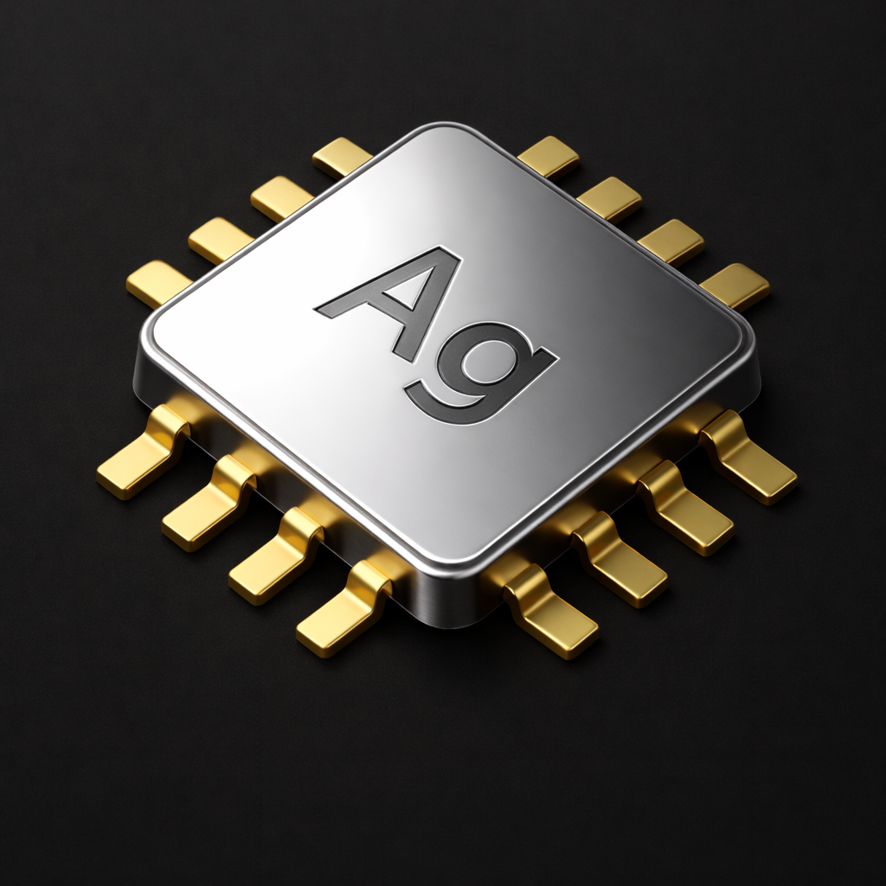

# **silver** lang


**A build language. MIT licensed.**
```
silver 0.8.8
Copyright (C) 2021 AR Visions — MIT License
```

---

## Why silver Exists

Software development is beautifully complex. There have been many demonstrated languages and build systems that scale. The idea behind silver is to expose all of this great work reliably on all platforms using succinct syntax, integrating their projects and models into a standard universal object model — Au, a C-based run-time providing a component model capable of post-init property pairs, single-arg construction, casts, and overrides — to target all devices natively, in a local-first manner, where you and your machine are sufficient to build anything.

silver does not replace CMake or Cargo or Make — it drives them into top-level modules you build natively for all platforms. Cross-platform is typically a frustrating process, and the goal of silver is to manage SDK environments within.

### import `User:Project/Commit-or-Branch`

silver clones the repository, identifies its native build system, builds it with that system's own tools, and links the result. Rust stays Rust. C stays C. Each project is built the way its authors intended. The URL defaults to your own relative Git ecosystem — your remote domain, public or private, forms the base address.

silver is unique in that it represents a single module mechanism to express an entire software product — its dependencies, and the models expressed with runtime reflection and dependency isolation trivially controlled with `public` and `intern` access.

---

## Overview

silver source files use the `.ag` extension. A module is a directory containing a source file with the same stem name — `myapp/myapp.ag`. The compiler reads the module path, tokenizes, parses, emits LLVM IR, and links the result into a shared library or executable.

Companion C or C++ files placed alongside the `.ag` source — `mymodule.c` or `mymodule.cc` — are compiled with Clang and linked in automatically. These sub modules integrate directly into the object model of silver (Au), with specific methods offloaded to these langs. There is no wrapper generation step, no binding language.  One merely declares a function with no implementation.  The method is then bound to these external languages where they have access to all fields as well as their own language facilities.

---

## Syntax

silver uses indentation for scoping, `#` for comments, and square brackets where most languages use parentheses.

```python
# single-line comment

##
multi-line
comment
##
```

### Variables

`:` declares a new member. `=` assigns to an existing one. These are distinct operations. `=` will never create a variable; `:` always does.

```python
count: i32 0         # declare count as i32, value of 0
count = 10           # assign to count
count += 1           # compound assignment
count2: 2            # default is i64, 2.0f is float, other-wise double
count3: bf16 [ 1.0 ] # half-precision better float support
```

At module scope, members are configuration inputs and runtime class controllers. Global state is meant to be controlled in this fashion — reducing complexity and increasing production by means of reducing state issues. They cannot be reassigned from within the module. They are set externally by the importer:

```python

import mymodule
    write-to-read-only: "value"
    debug:   true

```

The module defines what it accepts. The consumer provides values at import time. This is the interface.

Inside functions, `:` declares locals and `=` assigns:

```python

func example[]
    x: i32 # declare local
    x = 42 # assign
    name: string ["double quote is read-only and " + 'single interpolates: {x}']   # declare and assign inline

```

### Functions

Functions are declared with `func`, arguments in `[]`, and a return type after `->`:

```python
func add [a: i32, b: i32] -> i32
    return a + b

func greet [name: string]
    print 'hello, {name}'
```

When no `->` is given, the return type is `none`.

### Classes and Structs

```python
class Animal
    name: string
    sound: string

    func speak[] -> string [ sound ]

Animal ani [ name:'Rover', sound:'bark' ]
```

Structs are value types. Classes are reference-counted.  Fields are directly accessed by dot '.'

```python
struct Vec2
    x: f32
    y: f32

    operator + [b: Vec2] -> Vec2
        return Vec2[a.x + b.x, a.y + b.y]
```

Instance methods receive the instance as `a`. Struct methods receive a pointer to `a`.

### Inheritance

A class name becomes a keyword for declaring subclasses. The parent type is used directly:

```python
class Animal
    name: string

Animal Dog
    func init[]
        puts 'subclass of {typeid[super].name} has value of {name}'
```

`super` accesses the parent. `is` and `inherits` perform runtime type checks:

```python
if dog is Animal
    print 'it is an animal'
```

### Generics

Meta-driven classes accept type parameters with `<>`:
These do not expand code, and enable data-validation amongst other use-case.

```python
class Container<M: any>
    value: object
    func init[] -> none
        if not instanceof [ value, M ]
            puts 'we want a {M.ident}'
```

### Enums

```python
enum Color
    red
    green
    blue

enum Flags [ u8 ]
    readable:   1
    writable:   2
    executable: 4
```

The default storage type is `i32`. Values auto-increment from the last explicit value.

---

## Control Flow

### if / else

```python

if [ x > 0 ]
    print "positive"

el [ x == 0 ]
    print "zero"

el
    print "negative"
```

### for

`::` separates init, condition, and step:

```python
for [ i: i32 = 0 :: i < 10 :: i += 1 ]
    print '{i}'

```

### for / while

`for` with a condition is a while-loop. `for` followed by `while` is a traditional 'do-while':

```python

# for-condition
for [ running ]
    process

# for-init-condition-iter
for [ i : 0 :: running && i < 2 :: i += 1 ]
    process

# for-init-condition
for [ i : u16 [ 0 ] :: running && i < 2 ]
    process
    i += 1

# for-while
for step while not done

```

### switch / case / goto

```python

its important to note that break has no application in switch now, this leaves one able to break in statements written behind

another:true

switch value
    case 1
        if not another goto default
        # 'breaks' here -- can never follow-through without a goto [case] statement
    case 2
        print "two"
    case 3
        goto 1

    default
        print "other"

```

### break and return

```python

# applies to for statement only
break

# return statement
func method[] -> i64
    return result

# short-hand return syntax
func method[] -> i64 [ result ]

```

---

## Type System

### Primitives

| Type | Description |
|------|-------------|
| `bool` | 8-bit boolean |
| `i8`, `i16`, `i32`, `i64` | Signed integers |
| `u8`, `u16`, `u32`, `u64` | Unsigned integers |
| `f32`, `f64` | Floating point |
| `num` | Signed 64-bit (alias for `i64`) |
| `real` | Double precision (alias for `f64`) |
| `none` | Void |

### Built-in Types

| Type | Description |
|------|-------------|
| `string` | Managed string with methods (`split`, `mid`, `trim`, `index_of`, ...) |
| `array` | Dynamic array (reference-counted) |
| `map` | Hash map with ordered insertion |
| `path` | File system path with operations |
| `symbol` | Constant string pointer (`const char*`) |
| `handle` | Opaque pointer (`void*`) |

### Pointers and References

```python
ref x              # reference to x
new i32[100]       # allocate a typed vector (no boxing)
new f32[width * height]
```

`new` is exclusively for allocating contiguous, typed vector data. It exists so primitives need not be boxed. Classes and structs are constructed directly by name.

### Type Operators

```python
sizeof[MyType]     # size in bytes
typeid[MyType]     # type id node
```

### Null and Defaults

```python
x = null
value = x ?? fallback   # null coalescing
```

### Ternary

```python
result = cond ? value_a : value_b
```

---

## Operators

The full operator table is enumerated [below](#full-operator-table).

### Operator Overloading

Any operator can be overloaded on a class or struct:

```python
class Matrix
    data_shape : 4x4

    operator * [b: Matrix] -> Matrix
        # ...

    operator == [b: Matrix] -> bool
        # ...

    index [ index-value: shape ] -> f64
        return ref f64 vdata [ data_shape [ index-value ] ]
        # [ index-expression -- use shape for multi-dimensional access ]
```

### Cast Methods

```python
class Temperature
    value: f64

    cast string
        return '{value.round[ 2 ]}°C'

    cast f64
        return value
```

---

## Imports and Modules

There is no package manager. Imports resolve directly from Git or from local source. Every `import` is traceable and reproducible.

### Local Modules

```python
import mylib
```

This locates `mylib/mylib.ag` relative to the project, spawns a child compiler instance, builds the module, and loads its types into Au.

### Git Dependencies

```python
import user:project/abc1234
```

- **user** — Git owner. Defaults to the current project's remote.
- **project** — repository name.
- **abc1234** — a commit hash for determinism, a branch for convenience, or omitted for the default.

silver clones the repository and detects the build system:

| Detected File | Build System |
|---------------|-------------|
| `module/module.ag` | silver |
| `CMakeLists.txt` | CMake |
| `meson.build` | Meson |
| `Cargo.toml` | Cargo (Rust) |
| `BUILD.gn` | GN |
| `Makefile` / `configure` | Make / Autotools |

It builds the project, links the output, and registers the resulting types into Au. A build token is cached so unchanged dependencies are not rebuilt.

```python
import ar-visions:vulkan-headers/ccdf134
```

This fetches the Vulkan headers from a pinned commit on `ar-visions`, builds the project, and registers its types into the silver/Au model.

The import is not an entry in a dependency list. It is a statement of provenance: where the code lives, what version is meant, and how to make it real. Au receives the types. The module graph is the truth.

### C Header Imports

```python
import <stdio.h, string.h>
```

C headers are parsed through an integrated libclang frontend. Macros, types, and functions become available in the silver namespace.

```python
import KhronosGroup:Vulkan-Headers/main
    <vulkan/vulkan.h>
```

You can also specify an alternate Git URL with `from`:

```python
import KhronosGroup:Vulkan-Headers/main from https://alternate-git-url
    <vulkan/vulkan.h>
```

An `as` clause provides namespacing:

```python
import <GL/gl.h> as gl
```

### import LLMs

```python
import chatgpt as gpt

# the following is cached and in sync with a hash-identity of the query content given
func validate-input[text: string] -> string using gpt
    ['some text description', image ['reference-in-our-module.png']]
    ['refine result with more dictation']
```

The `using` keyword delegates function body generation to a registered codegen backend. The query content is hashed for cache identity, and dictation can include text, images, and iterative refinement.

---

## Platform Conditionals

```python
ifdef mac
    print "running on macOS"
else
    print "not macOS"
```

The boolean constants `mac`, `linux`, and `windows` are available at module scope.

---

## Lambdas

Lambdas in silver are flat — designed to reduce triangular code. A lambda declaration separates its call arguments from its captured context with `::`. You construct a lambda by providing its context arguments, and like `func`, call at expression level 0 without brackets (nested calls must use `[args]` within initializer):

```python
lambda on_event[event: string :: source: string] -> bool
    puts '{source}: {event}\n'
    return true

func run[]
    ui_handler:      on_event["ui"]
    network_handler: on_event["network"]
    ui_handler "click"              # prints: ui: click
    ui_handler "scroll"             # prints: ui: scroll
    network_handler "timeout"       # prints: network: timeout
```

We initialize lambdas with context arguments declared after `::`. The call arguments are passed flat. No nesting, anything you want live and referenced you merely use the `ref` keyword for.

---

## Error Handling

```python
try
    something_risky
catch
    print 'error occurred'
finally
    cleanup

# catch with error argument
try
    something_risky[]
catch [e: string]
    print 'error occurred: {e}'
```

---

## Access Modifiers

```python
public  name: string     # accessible from outside
intern  count: i32       # module-internal

static  shared_value: i32   # class-level, not per-instance
```

---

## Module Structure

A module is a directory. The file system is the schema we rely on to bind language together into an ABI-stable unified model. These languages (C/C++) may access all Au-based model features.

```
mymodule/
  mymodule.ag       # silver source
  mymodule.c        # C companion (optional, auto-linked)
  mymodule.cc       # C++ companion (optional, auto-linked)
```

Companion `.c` / `.cc` files are compiled with Clang and linked into the final product automatically.

---

## Full Operator Table

silver's operators are defined in Au as a unified enum (`OPType`). Each has a token form used in source and a named form used in operator overloading. Listed by precedence, highest first:

| Precedence | Token | Name | Description |
|------------|-------|------|-------------|
| 1 | `*` | `mul` | Multiplication |
| 1 | `/` | `div` | Division |
| 2 | `+` | `add` | Addition |
| 2 | `-` | `sub` | Subtraction |
| 3 | `>>` | `right` | Right shift |
| 3 | `<<` | `left` | Left shift |
| 4 | `>` | `greater` | Greater than |
| 4 | `<` | `less` | Less than |
| 5 | `>=` | `greater_eq` | Greater or equal |
| 5 | `<=` | `less_eq` | Less or equal |
| 6 | `==` | `equal` | Equality |
| 6 | `!=` | `not_equal` | Inequality |
| 7 | `is` | `is` | Type identity check |
| 7 | `inherits` | `inherits` | Inheritance check |
| 8 | `^` | `xor` | Bitwise XOR |
| 9 | `&&` | `and` | Logical AND (short-circuit) |
| 9 | `\|\|` | `or` | Logical OR (short-circuit) |
| 10 | `&` | `bitwise_and` | Bitwise AND |
| 10 | `\|` | `bitwise_or` | Bitwise OR |
| 11 | `??` | `value_default` | Null coalescing |
| 11 | `?:` | `cond_value` | Conditional value |

### Comparison (low-level)

Au's `comparison` enum maps directly to LLVM integer predicates:

| Name | Value | Description |
|------|-------|-------------|
| `equals` | 32 | Equal |
| `not_equals` | 33 | Not equal |
| `u_greater_than` | 34 | Unsigned greater |
| `u_greater_than_e` | 35 | Unsigned greater or equal |
| `u_less_than` | 36 | Unsigned less |
| `u_less_than_e` | 37 | Unsigned less or equal |
| `s_greater_than` | 38 | Signed greater |
| `s_greater_than_e` | 39 | Signed greater or equal |
| `s_less_than` | 40 | Signed less |
| `s_less_than_e` | 41 | Signed less or equal |

### Assignment Operators

| Token | Name |
|-------|------|
| `:` | `bind` |
| `=` | `assign` |
| `+=` | `assign_add` |
| `-=` | `assign_sub` |
| `*=` | `assign_mul` |
| `/=` | `assign_div` |
| `\|=` | `assign_or` |
| `&=` | `assign_and` |
| `^=` | `assign_xor` |
| `%=` | `assign_mod` |
| `>>=` | `assign_right` |
| `<<=` | `assign_left` |

### Unary and Keyword Operators

| Token | Description |
|-------|-------------|
| `!` / `not` | Logical NOT |
| `~` | Bitwise NOT |
| `%` | Modulo |
| `->` | Guard (safe pointer access) |

---

## File Watching

When building your own module, the compiler enters a watch loop. It waits for file changes, re-tokenizes, re-parses, and rebuilds. There is no separate watcher process. The compiler remains present with the source.

---

## Platforms

| OS | Library Extension | App Extension |
|----|-------------------|---------------|
| Linux | `.so` | (none) |
| macOS | `.dylib` | (none) |
| Windows | `.dll` | `.exe` |

Architectures: `x86_64`, `arm64`, `x86`, `arm32`

---

## Example: a Vulkan Application

```python
# platform-conditional import
linux ?? import wayland-protocols/810f1ada from https://gitlab.freedesktop.org/wayland/wayland-protocols

import KhronosGroup:Vulkan-Headers/main
    <vulkan/vulkan.h>

import KhronosGroup:Vulkan-Tools/main
    -DVULKAN_HEADERS_INSTALL_DIR={install}
    {linux ?? -DWAYLAND_PROTOCOLS_DIR={install}/checkout/wayland-protocols}

import <stdio.h>

# module members are configuration inputs — not reassignable
version: '22'

class Vulkan
    intern instance: VkInstance
    public major:    i32
    public minor:    i32

    func init[] -> none
        result: vkCreateInstance [
            [
                sType: VK_STRUCTURE_TYPE_INSTANCE_CREATE_INFO
                pApplicationInfo
                    sType:              VK_STRUCTURE_TYPE_APPLICATION_INFO
                    pApplicationName:   "trinity"
                    applicationVersion: VK_MAKE_VERSION[1, 0, 0]
                    pEngineName:        'trinity-v{version}'
                    engineVersion:      VK_MAKE_VERSION[const i64[first[version]], const i64[last[version]], 0]
                    apiVersion:         vk_version
            ], null, instance]

        # methods at expr-level 0 do not invoke with [ ] unless variable argument
        verify result == VK_SUCCESS, 'could not start vulkan {major}.{minor}'

class Window
    intern vk:   Vulkan
    public size: shape

# app is a base class — its name becomes the keyword for subclassing
app test_vulkan
    public  queue_family_index: array i64[2x4] [2 2 2 2, 4 4 4 4]
    intern  an-instance:        Vulkan
    intern  window:             Window
    public  shared:             'a-string initialized with {version}'

    func init[] -> none
        an-instance = Vulkan[major: 1, minor: 1]
        window = Window
            vk:   an-instance
            size: 444x888
```

`intern` members are isolated to the module. `public` members are exposed for reflection, serialization into JSON, CSS property binding, and UX transitions. The `shape` type (`444x888`) is a native dimensional literal.

---

## License

MIT License. Copyright (C) 2021 AR Visions. See [LICENSE](LICENSE).


Orbiter -- IDE being built with silver (was C++)
[https://github.com/ar-visions/orbiter.git]

Hyperspace
spatial dev kit, ai module & training scripts (will be silver)
[https://github.com/ar-visions/hyperspace.git]

# **import** keyword
**silver** starts with **import**. The **import** keyword lets you build and include from projects in any language, with coupled configuration parameters and <comma, separated> includes.  Local source links are prioritized before external checkouts, so you can build externals locally with your own changes.  This is a far better way to collaborate in open source with yourself and others. silver simply gets out of the way when it comes to git for your own source; it's merely importing.  The build process will recognize the various environment variables such as **CC**, **CXX**, **RUSTC**, **CPP**

see: [Au project](https://github.com/ar-visions/silver/blob/master/src/Au)
