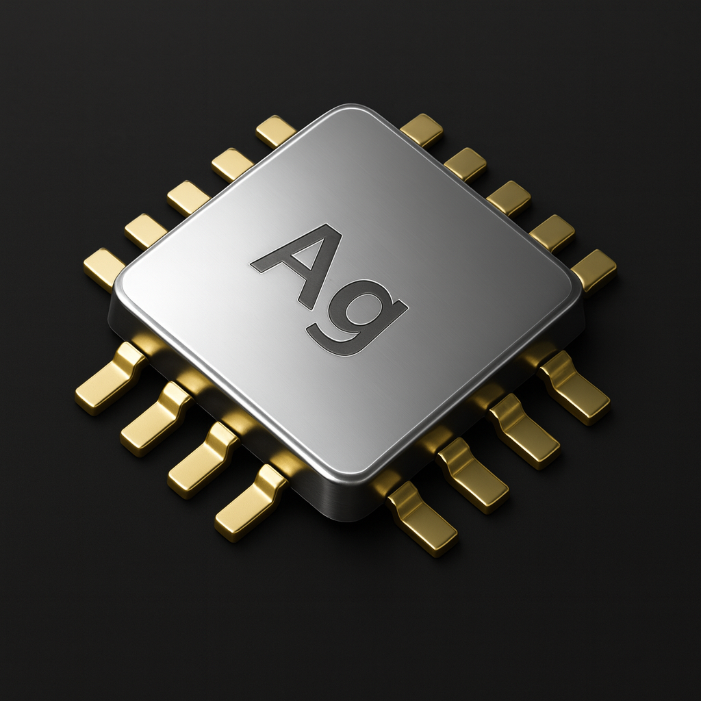

# **silver** lang


```
silver 0.88
Copyright (C) 2017 Kalen Novis White — MIT License
```

---

**silver is a build language.** One `.ag` file defines a module, its `import` dependencies by its own git service (default) or from any url. silver defines a reflective component model which interpolates in C and CC.  using native, we may build to all devices as binary or shared library. `import` a git repository by `owner:name/commit` ; silver detects its build system, builds it with its own tools, and links the result. `import` a C header, its models and macros are made available at design time through an integrated libclang frontend. 

write .c or .cc compilation-units alongside your `.ag` source to out-source methods for your component, with all fields accessible without wrapping or binding code.  it compiles and links automatically with full access to your types. The boundary between languages disappears because the object model is shared — Au, a C runtime with reference counting, type reflection, and single-inheritance, serves C, C++, and silver equally.

**silver is debuggable.** Every build emits full LLDB debug information — source maps, code-coverage, variable inspection, stepping, breakpoints — on every platform. Debug is the default because that's where you spend your time, and production failures on platforms you can't inspect are the failures that end projects. silver targets Linux, macOS, Windows, and embedded ARM from a single source tree with a self-contained SDK.

**silver gives you controlled polymorphism.** Method calls are direct by default — no vtable lookup, no indirection, just a static call to the implementation you wrote. When you need runtime dispatch, you ask for it explicitly: `target.method*[args]` invokes through the vtable, resolving to the actual subtype's implementation at runtime. The same `*` appears in type declarations — `element*` as a parameter means "any subtype of element," signaling that the code is designed to operate generically. This keeps polymorphism visible and intentional: the vast majority of calls compile to direct invocations with zero overhead, and the developer decides exactly where dynamic dispatch is worth the cost. No hidden vtable traffic, no surprise virtual calls — just direct calls unless you say otherwise. This isn't just about dispatch cost: direct calls let LLVM see through the call boundary, enabling inlining, constant propagation, and auto-vectorization that indirect calls make impossible. Every vtable lookup is an optimization barrier — silver removes it by default and gives it back only when you need it.

**silver simplifies comparisons.** Multi-value checks use parenthesized lists: `x == (1, 2, 3)` expands to `x == 1 || x == 2 || x == 3` with short-circuit evaluation, while `x != (1, 2, 3)` becomes `x != 1 && x != 2 && x != 3`. Range syntax checks bounds naturally: `x == (2...10)` means `x >= 2 && x <= 10`, `x == (2..<10)` excludes the upper bound, and `x != (2...10)` checks that `x` falls outside the range. No helper functions, no verbose chains — the intent reads directly.

**silver is expressive where it matters.** Classes are reference-counted with single inheritance, post-init property pairs, and operator overloading. Structs are value types. Enums infer in switch cases. Inline assembly is platform-conditional on the same line. Functions accept arguments without commas — matched by type like CSS shorthand — or with commas for positional order. Shapes are first-class literals: `new f32 [32x32x1]` allocates a typed tensor. Scalars let you write `200px` or `16ms` as type-safe values. From neural networks to Vulkan renderers to audio DSP, the foundry focuses of media generation and advanced user experience for AI PC domain.  silver's IDE **orbiter** is based on trinity engine, all part of `foundry`, available by make or **import**.

---

### import `User:Project/Commit`

silver builds from decentralized repositories, not limiting package managers which prove to be more prone to both insecurities and gate-keeping.  what you choose to depend on is entirely up to you, and you can now describe that in one import line. a single import identifies its build system, builds with that system's own tools, and links the result. Each dependency is built the way its authors intended, then imported into design-time.

```
import KhronosGroup:Vulkan-Headers/29184b9
import glfw:glfw/fdd14e6 <GLFW/glfw3.h>
    +GLFW_INCLUDE_VULKAN
```

---

## Overview

silver source files use the `.ag` extension. A module is a directory with a matching source file — `myapp/myapp.ag`. The compiler tokenizes, parses, emits LLVM IR, and links the result into a shared library or executable.

C or C++ companion files alongside the `.ag` source — `mymodule.c` or `mymodule.cc` — compile with Clang and link automatically. They integrate directly into Au's object model. Declare a function in silver with no body, implement it in C or C++. No wrappers, no bindings, no codegen. The external code has full access to all fields and its own language facilities.

---

### Variables

`:` declares a new member. `=` assigns to an existing one. These are distinct operations. `=` will never create a variable; `:` always does.

```python
count  : i32 0                 # typed with value
count  = 10                    # assign existing
count += 1                     # compound assignment
count2 : 2                     # inferred i64
ratio  : f32 [ 0.0 ]           # bracketed initializer
flag   : bool [ true ]         # boolean
name   : string [ 'hello' ]    # string with single quotes
p      : ref i32               # pointer (reference)
data   : new f32 [ 1024 ]      # heap allocation
buf    : new f32 [ 32x32 ]     # heap allocation with shape
```

At module scope, members are configuration inputs. They cannot be reassigned from within the module — they are set externally by the importer:

```python
import mymodule
    debug:   true
    version: "1.0"
```

### Functions

Functions are declared with `func`, arguments in `[]`, and a return type after `->`:

```python
func add [ a: i32, b: i32 ] -> i32
    return a + b

func greet [ name: string ]
    puts 'hello, {name}'

# single-line comment

##
multi-line
comment
##
```

```

When no `->` is given, the return type is `none`. At expression level 0 (top of a statement), calls without arguments omit the brackets:

```python
ensure_seeded           # no brackets needed
result: add [ 1, 2 ]   # brackets needed in expression
```

Short-hand return for single expressions:

```python
func is_ready [] -> bool [ true ]
func square [ x: f32 ] -> f32 [ x * x ]
```

Access modifiers control visibility:

```python
public func api_function [] -> i32     # exported
intern func helper [] -> i32           # module-internal
```

### Expect Functions

`expect` before `func` marks a function as a test. The compiler verifies it returns true:

```python
expect func all_tests [] -> bool
    return math_test && io_test && parse_test
```

### Subprocedures

`sub` declares an inline subprocedure. `return` inside a sub assigns to the declared variable, not the enclosing function. `break` exits with the type's default value:

```python
func transform [ a: i64, b: i64 ] -> i64
    z: i32 sub
        if [ b > 0 ]
            return b + 1
        break
    # z is b+1 or 0
    return z
```

### Callable Subs

A sub's body is stored on the variable. Calling `x[]` re-evaluates the sub with the current scope and returns the result — without reassigning `x`:

```python
validate: bool sub
    if [ !ready ]
        return false
    return count <= max

# later — re-invoke with current state:
if [ !validate[] ]
    bail
```

This replaces `goto` with a named, returnable, scoped block. The sub is a computation you can revisit.

---

### Commaless Type-Matching (CSS-Style Selectors)

silver functions accept arguments without commas. When commas are absent, the parser matches each argument to the best-fit parameter by type — like CSS shorthand properties. When commas are present, arguments are positional.

```python
# commaless — type-matched, order flexible:
set_margin 20px
set_color red 0.8
transition 200ms ease_in

# with commas — positional, explicit order:
resize [ 800, 600 ]
```

This works because silver has no variadic functions — every parameter has a known type, so every argument can be matched unambiguously. The comma's presence or absence changes the parsing strategy:

- **No commas** → match by type (CSS selector style)
- **Commas** → match by position (traditional)

The deliberate exclusion of varargs is what enables this. Fixed arity means every type is known. Every argument finds its parameter.

---

### Scalar Types

`scalar` declares a type that wraps a single numeric value. The type name becomes a suffix for numeric literals. `200px` is parsed as two neighboring tokens — the parser sees the number, checks if the neighbor is a scalar type, and constructs it. No special syntax — the struct name IS the suffix. Scalar types are type-safe: `200px` and `200em` are different types, and passing one where the other is expected is a compile error.

```python
scalar px  : f32
scalar em  : f32
scalar deg : f32
scalar rad : f32
scalar ms  : i64

width:    200px
margin:   1.5em
rotation: 90deg
delay:    16ms
```

Scalars define casts between each other, so unit conversions are built into the type system. The conversion compiles to a single arithmetic instruction — zero overhead, full type safety.

```python
scalar deg : f32
scalar rad : f32
    cast -> deg [ a * 57.2958 ]
    cast -> f32 [ a ]

rotation: 90deg
r: rad rotation    # converts via cast: 90 * 0.0174533
angle: f32 r       # extracts raw float
```

---

### Keyword Tokens

Curly braces `{ }` parse as compacted token literals when the expected type is `tokens`. Used for declarative UI properties and layout:

```python
panel { l0 t0 r0 b0 }
button "click" { m0 b20 shadow }
```

Each space-separated value inside `{ }` becomes a token. Neighboring characters are compacted (`blur:4` stays as one token).

---

### Inline Assembly

`asm` declares an inline assembly block with Intel syntax. Input variables are listed in brackets, and `return` yields the result:

```python
func transform [ a: i64, b: i64 ] -> i64
    x: i64 [ a + 1 ]
    y: i64 asm [ x, b ]
        add x, b
        return x
    return y
```

Platform-conditional assembly compiles only on the matching architecture. The define name goes on the same line as `asm`:

```python
asm x86_64
    mov rax, 1
    syscall

asm arm64
    mov x0, #1
    svc #0
```

When no `[args]` are given, asm auto-gathers in-scope variables from the body.

---

## Types

### Primitives

| Type | Description |
|------|-------------|
| `bool` | Boolean |
| `i8`, `i16`, `i32`, `i64` | Signed integers |
| `u8`, `u16`, `u32`, `u64` | Unsigned integers |
| `f32`, `f64`, `bf16` | Floating point |
| `num` | Signed 64-bit (alias for `i64`) |
| `none` | Void |

### Built-in Types

| Type | Description |
|------|-------------|
| `string` | Managed string with methods |
| `array` | Dynamic array (reference-counted) |
| `map` | Hash map with ordered insertion |
| `path` | File system path with operations |
| `symbol` | Constant string pointer (`const char*`) |
| `handle` | Opaque pointer (`void*`) |
| `shape` | Dimensional literal (e.g., `32x32x1`) |

### Pointers and References

```python
p: ref i32              # pointer to i32
r: ref myvar            # reference to existing variable
data: new f32 [ 100 ]   # allocate typed vector
buf: new i32 [ 4x4 ]    # allocate with shape
```

`new` allocates contiguous typed vector data so primitives need not be boxed. Classes and structs are constructed directly by name.

### Type Operations

```python
sizeof [ MyType ]       # size in bytes
sizeof MyType           # also valid without brackets
typeid [ MyType ]       # runtime type id

# type casting
x : (count to f32)      # convert i32 to f32
p : (obj to ref u8)     # cast object to byte pointer
```

### Aliases

```python
alias astrings: array string
```

---

## Enums

```python
enum Color [ u8 ]       # explicit storage type
    red:    1
    green:  2
    blue:   3
    alpha:  4

enum Optimizer           # default i32 storage
    sgd:  0
    adam: 1
```

Access with `EnumName.member`. Bare member names work in switch cases when the type is inferred:

```python
switch [ initializer ]
    case random
        setup_random
    case zeros
        clear_data
    case glorot_uniform
        setup_glorot
```

---

## Structs

Structs are value types (inlay, passed by reference to methods):

```python
struct vec3f
    public x: f32
    public y: f32
    public z: f32

    operator + [ b: vec3f ] -> vec3f [ x: x + b.x, y: y + b.y, z: z + b.z ]
    operator - [ b: vec3f ] -> vec3f [ x: x - b.x, y: y - b.y, z: z - b.z ]
    operator == [ b: vec3f ] -> bool [ x == b.x && y == b.y && z == b.z ]

    func dot [ b: vec3f ] -> f32
        return x * b.x + y * b.y + z * b.z

    func cross [ b: vec3f ] -> vec3f
        return vec3f [
            x: y * b.z - z * b.y
            y: z * b.x - x * b.z
            z: x * b.y - y * b.x
        ]

    func length [] -> f32
        return sqrtf [ x * x + y * y + z * z ]

    func normalize [] -> vec3f
        len: length
        return vec3f [ x: x / len, y: y / len, z: z / len ]

    cast -> string [ '[ {x}, {y}, {z} ]' ]
```

Construct with named fields:

```python
a: vec3f [ x: 1.0, y: 2.0, z: 3.0 ]
b: vec3f [ x: 4.0, y: 5.0, z: 6.0 ]
c: a + b
d: a.dot [ b ]
s: string a    # cast to string
```

---

## Classes

Classes are reference-counted, heap-allocated:

```python
class Counter
    public count: i64
    public name:  string

    func init []        count = 0
    func increment []   count += 1

    operator += [ n: i64 ] -> i64
        return add [ n ]

    func add [ n: i64 ] -> i64
        count += n
        return count

    cast -> i64
        return count
```

Construct with property pairs:

```python
c: Counter [ count: 0, name: 'TestCounter' ]
c.increment
c += 7
v: i64 c     # cast to i64
```

### Member Access

- `public` — accessible from outside
- `intern` — module-internal
- `context` — read-only, injected from scope by type matching

```python
class classy_class
    public i: i64

Counter DoubleCounter
    context contextual: classy_class

    func increment [] -> none
        super.increment
        count += 1
        count += contextual.i
```

### Inheritance

A class name becomes a keyword for declaring subclasses:

```python
class Animal
    name: string

Animal Dog
    func init []
        puts 'subclass of {typeid[super].name}'
```

`super` accesses the parent. `is` and `inherits` perform runtime type checks:

```python
if [ dog is Animal ]
    puts 'it is an animal'

if [ s inherits array ]
    puts 'it is an array'
```

### Elaboration

When a subclass knows that an inherited member is actually a more specific type, it can **elaborate** on that member rather than adding a new one. This narrows the type for the compiler without changing storage or layout — unlike C++, no new member is introduced:

```python
Display Window
    public ux       : UXComposer
    public compose  : Canvas

media_app app
    w: Display              # base class declares w as Display

media_app trinity
    elaborate w  : Window       # same member, narrower type
    elaborate ux : UXComposer   # same member, narrower type

    func render []
        w.compose.clear [ '#000' ]   # compose is visible because w is Window
        w.ux.animate []              # ux is visible because w is Window
```

The `elaborate` keyword signals that no new storage is added — the member shares the same index and visibility as the original. The compiler simply treats it as the narrower type within the declaring class and its methods. The types must be compatible — the elaborated type must inherit from the original.

### Constructors

Multiple constructors can be overloaded by argument type:

```python
class image
    uri: path

    construct [ i: symbol ]
        uri = path i

    construct [ i: cstr ]
        uri = path i

    construct [ i: string ]
        uri = path i
```

### Static Members and Methods

```python
class font
    intern static font_manager_init:    hook
    intern static font_manager_dealloc: hook

    static func set_font_manager [ init: hook, dealloc: hook ] -> none
        font_manager_init    = init
        font_manager_dealloc = dealloc
```

### Generics

Meta-driven classes accept type parameters with `<>`. These do not expand code — they enable data-validation:

```python
class Container<M: any>
    value: object
    func init [] -> none
        if not instanceof [ value, M ]
            puts 'we want a {M.ident}'
```

---

## Control Flow

### if / el

```python
if [ x > 10 ]
    result = 1
el [ x > 3 ]
    result = 2
el
    result = 3
```

### for

`,` separates init, condition, and step.

one single expression is condition only
two expressions mean member assignment and condition, three or more indicate iterator add-ons
this means for is used in-place of a 'while' when you have a condition alone

```python

# three-part with ,
for [ i: i32 0, i < count, i += 1 ]
    floats[i] = 0.0f

# condition-only (while loop)
for [ running ]
    process

# two-part requires member assignment
for [ something:1, running && something < 4 ]
    process
    something += 1

```

### switch / case

```python
switch [ expr ]
    case value1
        body
    case value2, value3
        body
    default
        body
```

Cases never fall through. Use `goto` to jump between cases:

```python
switch [ value ]
    case 1
        if [ not another ] goto default
    case 2
        puts "two"
    default
        puts "other"
```

### break / continue / return

```python
break              # exits for loop
continue           # next iteration
return value       # return from function
```

---

## Strings

Single quotes interpolate, double quotes are read-only:

```python
x: i64 42
s: string 'the answer is {x}'
puts s

v: vec3f [ x: 3.14, y: 2.72, z: 1.0 ]
puts 'vec is {v}'     # uses cast -> string

# nested interpolation
puts 'result: {add [ 1, 2 ]}'
```

---

## Collections

### Arrays

```python
# typed array
ar: array i32 [ 4x4 ] [ 1 2 3 4, 1 1 1 1, 2 2 2 2, 3 3 3 3 ]

# heap-allocated vector with shape
ar2: new i32 [ 4x4 ] [ 1 2 3 4, 1 1 1 1, 2 2 2 2, 3 3 3 3 ]

# shape query
sh: shape [ ar2.shape ]
```

### Maps

```python
ma: map string [ string ]
    'key': 'value'
    'a':   'alpha'
    'b':   'bravo'

k: string ma [ 'key' ]     # lookup by key
```

### Iteration

```python
for [ val:ElementType ] in array_member
    use val

for [ val:ValueType, key:KeyType ] in map_member
    use key, val
```

---

## Shapes

Shapes are native dimensional literals using `x` as separator:

```python
s1: 4x4
s2: 32x32x1
s3: 4x4 * 2
s4: 4x4 << 1
s5: (4x4 << 1) >> 1

data: new f32 [ 32x32x1 ]
```

**Important**: `*` inside `[]` after `new` is a shape operator. Pre-compute products as i32 before passing to `new`:

```python
sz: i32 [ a * b ]
buf: new f32 [ sz ]
```

---

## Error Handling

### expect / check / fault

```python
# expect: debugtrap on failure (development)
expect condition, 'error message {detail}'

# check: verify assertion
check width > 0 && height > 0, "null image given to resize"
check false, 'unsupported format: {e}'

# fault: unconditional error
fault 'critical failure'
```

### try / catch / finally

```python
try
    something_risky
catch [ e: string ]
    puts 'error: {e}'
finally
    cleanup
```

---

## Lambdas

Lambdas separate call arguments from captured context with `::`:

```python
lambda on_event [ event: string :: source: string ] -> bool
    puts '{source}: {event}'
    return true

func run []
    ui_handler:      on_event [ "ui" ]
    network_handler: on_event [ "network" ]
    ui_handler "click"           # prints: ui: click
    network_handler "timeout"    # prints: network: timeout
```

---

## Operator Overloading

Any operator can be overloaded. Short-hand form uses brackets for inline return:

```python
struct Vec2
    public x: f32
    public y: f32

    operator +  [ b: Vec2 ]   -> Vec2 [ x: x + b.x, y: y + b.y ]
    operator == [ b: Vec2 ]   -> bool [ x == b.x && y == b.y ]
    operator /  [ b: double ] -> Vec2 [ x: b + 1, y: b + 1 ]

    cast -> string [ '{x}, {y}' ]

class Counter
    public count: i64
    operator += [ n: i64 ] -> i64
        return add [ n ]
```

### Hat Operator — Multi-Value Comparison

```python
x: i64 5
r1: x == (1, 3, 5, 7, 9)    # true — x matches one of these
r2: y != (1, 2, 3, 4, 5)    # true — y matches none
```

---

## Platform Conditionals

### ifdef

```python
ifdef mac
    import KhronosGroup:MoltenVK/main

ifdef linux
    import wayland
```

Platform defines: `x86_64`, `arm64`, `mac`, `linux`, `windows`

### Conditional Assembly

`asm` with a platform define on the same line only compiles on that architecture:

```python
asm x86_64
    mov rax, 1
    syscall
```

---

## Imports

### Local Modules

```python
import mylib
```

Locates `mylib/mylib.ag` relative to the project, builds it, and loads its types.

### Module with Parameters

```python
import test3
    coolteen: 'Tim2'
```

### C Header Imports

```python
import <stdio.h>
import <string.h>
```

C headers are parsed through an integrated libclang frontend. Macros, types, and functions become available in scope.

### Git Dependencies

```python
import user:project/commit_hash
```

- **user** — Git owner
- **project** — repository name
- **commit_hash** — commit, branch, or tag

```python
import AcademySoftwareFoundation:openexr/0b83825
    -DBUILD_SHARED_LIBS=ON

import madler:zlib/51b7f2a <zlib.h>
    -DCMAKE_POLICY_VERSION_MINIMUM=3.5

import glennrp:libpng/07b8803 <png.h>
    -DCMAKE_POLICY_VERSION_MINIMUM=3.5
    -DZLIB_LIBRARY=$IMPORT/lib/libz.so
    -DZLIB_INCLUDE_DIR=$IMPORT/include
```

silver clones the repository, detects the build system, and builds:

| Detected File | Build System |
|---------------|-------------|
| `module/module.ag` | silver |
| `CMakeLists.txt` | CMake |
| `meson.build` | Meson |
| `Cargo.toml` | Cargo (Rust) |
| `BUILD.gn` | GN |
| `Makefile` / `configure` | Make / Autotools |

### LLM Codegen Imports

```python
import chatgpt
    model: 'gpt-5'

func validate_input [ text: string ] -> string using chatgpt
    [ 'describe the task', image 'reference.png' ]
    [ 'additional constraints' ]
```

The `using` keyword delegates function body generation to a registered codegen backend. Query content is hashed for cache identity.

---

## Short-Circuit Expressions

```python
a: true_test || return false     # short-circuit with return
b: condition && operation        # short-circuit evaluation
value: ptr ?? fallback           # null coalescing
result: cond ? val_a : val_b    # ternary
```

---

## App Entry Point

`app` declares the application entry point:

```python
app test2
    func init [] -> none
        setup_code

    func run [] -> int
        main_loop
```

---

## Module Structure

```
mymodule/
  mymodule.ag       # silver source
  mymodule.c        # C companion (optional, auto-linked)
  mymodule.cc       # C++ companion (optional, auto-linked)
```

---

## Full Operator Table

Listed by precedence, highest first:

| Precedence | Token | Name | Description |
|------------|-------|------|-------------|
| 1 | `*` | `mul` | Multiplication |
| 1 | `/` | `div` | Division |
| 1 | `%` | `mod` | Modulo |
| 2 | `+` | `add` | Addition |
| 2 | `-` | `sub` | Subtraction |
| 3 | `>>` | `right` | Right shift |
| 3 | `<<` | `left` | Left shift |
| 4 | `>` | `greater` | Greater than |
| 4 | `<` | `less` | Less than |
| 5 | `>=` | `greater_eq` | Greater or equal |
| 5 | `<=` | `less_eq` | Less or equal |
| 6 | `==` | `equal` | Equality |
| 6 | `!=` | `not_equal` | Inequality |
| 7 | `is` | `is` | Type identity |
| 7 | `inherits` | `inherits` | Inheritance check |
| 8 | `^` | `xor` | Bitwise XOR |
| 9 | `&&` | `and` | Logical AND (short-circuit) |
| 9 | `\|\|` | `or` | Logical OR (short-circuit) |
| 10 | `&` | `bitwise_and` | Bitwise AND |
| 10 | `\|` | `bitwise_or` | Bitwise OR |
| 11 | `??` | `value_default` | Null coalescing |
| 11 | `?:` | `cond_value` | Conditional value |

### Assignment Operators

| Token | Name |
|-------|------|
| `:` | `bind` (declare) |
| `=` | `assign` |
| `+=` `-=` `*=` `/=` | Compound arithmetic |
| `\|=` `&=` `^=` `%=` | Compound bitwise |
| `>>=` `<<=` | Compound shift |

### Unary

| Token | Description |
|-------|-------------|
| `!` / `not` | Logical NOT |
| `~` | Bitwise NOT |
| `ref` | Address-of / pointer cast |

---

## Platforms

| OS | Library Extension | App Extension |
|----|-------------------|---------------|
| Linux | `.so` | (none) |
| macOS | `.dylib` | (none) |
| Windows | `.dll` | `.exe` |

Architectures: `x86_64`, `arm64`, `x86`, `arm32`

---

## Build & Run

```bash
make                    # build the silver compiler
make debug              # build with debug symbols
make clean              # clean generated headers

# compile a .ag program
./platform/native/bin/silver foundry/ai-test/ai-test.ag

# run the output
./platform/native/release/ai-test
```

---

## License

MIT License. Copyright (C) 2017 Kalen Novis White. See [LICENSE](LICENSE).


[Orbiter](https://github.com/ar-visions/orbiter.git) — IDE built with silver

[Hyperspace](https://github.com/ar-visions/hyperspace.git) — spatial dev kit & AI module
